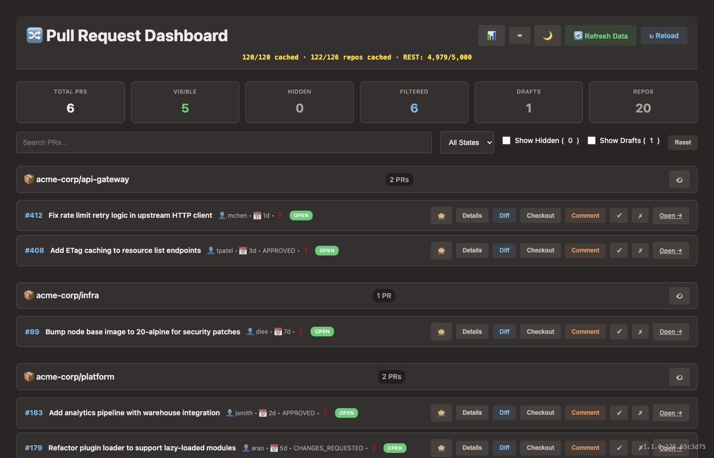
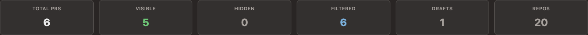
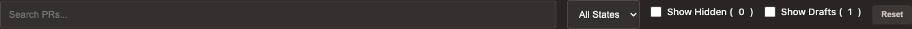
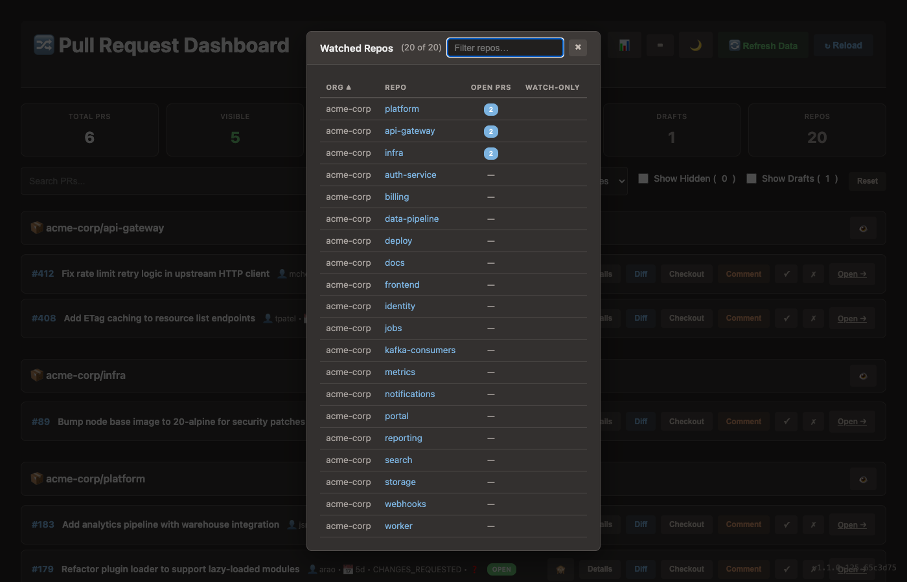
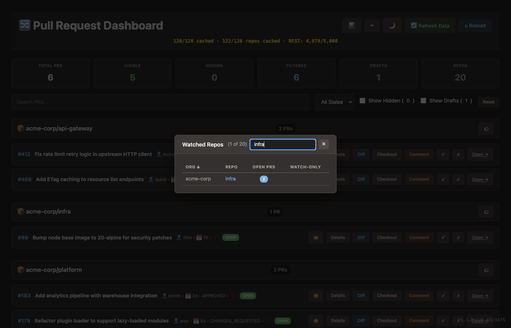
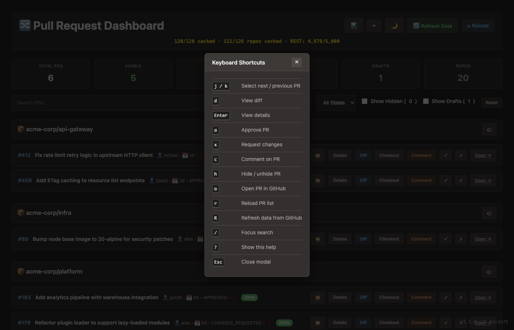

# PR Dashboard

A containerized pull request dashboard that integrates with [`ghreport`](https://github.com/slmingol/ghreport) and the GitHub CLI to provide a consolidated view of all monitored PRs with review tracking and management features.

## Screenshots

### Main dashboard



PRs grouped by repository, with review status badges, metadata, and action buttons on each card.

---

### Stats bar



Real-time counts across Total, Visible, Hidden, Filtered, Drafts, and Repos. The **Repos** tile is clickable.

---

### Filter bar



Keyword search, state filter, Show Hidden / Show Drafts toggles, and a Reset button. All preferences persist across page loads.

---

### Watched repos modal



Sortable table of all watched repos with open PR counts and watch-only status. Click any column header to sort.



Type in the filter box to narrow by org or repo name. Count updates to show matched / total.

---

### Keyboard shortcuts



Press `?` or click the `⌨` button in the header to open the reference modal.

---

## Features

### Core

- **Consolidated PR view** -- all PRs from `ghreport` output, grouped by repository with sticky headers
- **Review status tracking** -- Approved / Changes Requested / Commented badges per PR
- **Hide/unhide PRs** -- reduce clutter without losing context; persisted in localStorage
- **Watch-only repos** -- mark repos as view-only to suppress review actions (useful for monitoring repos you don't participate in)
- **Search & filter** -- by keyword, PR state (Open/Closed/Merged), hidden status, or draft status
- **Statistics bar** -- real-time counts for Total, Visible, Hidden, Filtered, Drafts, and Repos (clickable)

### Review workflow

- Approve, request changes, or comment directly from the dashboard
- Integrated comment modal (no browser prompts)
- Review buttons in the diff view modal
- PR list refreshes to reflect your new review status after submission

### PR operations

- View PR details and metadata
- View diffs with syntax highlighting (unified and split modes, preference saved)
- Checkout PR branches locally
- Open any PR in GitHub

### Data refresh

- **Refresh Data** -- re-runs `ghreport` inside the container to fetch the latest PRs from all monitored repositories (20-30 seconds for 100+ repos); streams progress via SSE
- **Reload** -- reloads the PR list from the current `ghreport` output file (instant)

### UI/UX

- Dark/light mode with saved preference
- Compact single-line PR cards for maximum density
- Toast notifications for actions
- Keyboard shortcuts for full mouse-free operation (see below)
- Filter preferences (search, state, show-hidden, show-drafts) persist across page loads

## Keyboard Shortcuts

Press `?` or click the `⌨` button in the header to open the in-app shortcuts reference.

| Key | Action |
|-----|--------|
| `j` / `k` | Select next / previous PR |
| `d` | View diff |
| `Enter` | View details |
| `a` | Approve PR |
| `x` | Request changes |
| `c` | Comment on PR |
| `h` | Hide / unhide PR |
| `o` | Open PR in GitHub |
| `r` | Reload PR list |
| `R` | Refresh ghreport data |
| `/` | Focus search box |
| `?` | Show keyboard shortcuts |
| `Esc` | Close modal |

Action keys (`a`, `x`, `c`) are silently blocked for watch-only repos.

## Prerequisites

- **Podman Desktop** or **Docker**
- **GitHub CLI** (`gh`) installed and authenticated on the host
- A GitHub personal access token

`ghreport` is automatically installed inside the container during build -- no host installation required.

## Setup

### 1. Create environment file

```bash
echo "GH_TOKEN=$(gh auth token)" > .env
```

### 2. Configure ghreport

The container reads `~/.config/ghreport/config.yaml` for the `subscribedRepos` list. Mount it into the container (already configured in `docker-compose.yml`):

```yaml
volumes:
  - ~/.config/ghreport:/root/.config/ghreport:ro
```

You can also set `subscribedRepos` directly in `.env`:

```bash
echo 'subscribedRepos=org/repo1 org/repo2 org/repo3' >> .env
```

### 3. Build and start

```bash
make up      # dev mode (live reload)
make build   # production build
```

Or directly:

```bash
podman compose up -d --build
```

### 4. Open the dashboard

[http://localhost:3000](http://localhost:3000)

## Makefile targets

```
make list      # show all targets
make up        # start in dev mode
make down      # stop container
make restart   # restart running container
make logs      # tail container logs
make shell     # exec into container
make build     # full rebuild (production)
make clean     # remove container and image
```

## Configuration

### Environment variables

| Variable | Required | Default | Description |
|----------|----------|---------|-------------|
| `GH_TOKEN` | Yes | -- | GitHub personal access token |
| `GITHUB_TOKEN` | Auto | same as GH_TOKEN | For ghreport authentication |
| `subscribedRepos` | No | from config.yaml | Space-separated repos to monitor |
| `NODE_ENV` | No | `production` | Node environment |
| `PORT` | No | `3000` | Server port |
| `GHREPORT_OUTPUT` | No | `/data/ghreport.txt` | Path to ghreport output inside container |

### Volume mounts (docker-compose.yml)

```yaml
volumes:
  - ~/.config/gh:/root/.config/gh:ro              # gh CLI auth
  - ~/.config/ghreport:/root/.config/ghreport:ro  # ghreport config
  - ~/ghreport-output:/data                       # ghreport output directory
  - ~/.gitconfig:/root/.gitconfig:ro              # git config for checkout
```

### Browser storage (localStorage)

| Key | Description |
|-----|-------------|
| `theme` | `dark` or `light` |
| `hiddenPRs` | Array of `"owner/repo#number"` strings |
| `watchOnlyRepos` | Object keyed by `"owner/repo"` |
| `diffView` | `unified` or `split` |
| `filterSearch` | Last search term |
| `filterState` | Last state filter value |
| `filterShowHidden` | Last show-hidden checkbox state |
| `filterShowDrafts` | Last show-drafts checkbox state |

## Architecture

### Stack

- **Base image**: `node:18-alpine`
- **Additional tools**: `github-cli`, `git`, `go` (for ghreport build)
- **ghreport**: Installed via `go install github.com/slmingol/ghreport@latest`
- **Backend**: Node.js 18 + Express 4.18
- **Frontend**: Vanilla JavaScript, no build step
- **Port**: 3000

### API endpoints

| Method | Path | Description |
|--------|------|-------------|
| GET | `/api/prs` | All PRs with review status |
| GET | `/api/user` | Current authenticated GitHub user |
| GET | `/api/repos` | Subscribed repo list from ghreport config |
| GET | `/api/pr/:owner/:repo/:number` | PR details |
| GET | `/api/pr/:owner/:repo/:number/diff` | PR diff |
| POST | `/api/pr/:owner/:repo/:number/checkout` | Checkout branch locally |
| POST | `/api/pr/:owner/:repo/:number/comment` | Add comment |
| POST | `/api/pr/:owner/:repo/:number/review` | Submit review |
| GET | `/api/refresh-ghreport-stream` | Re-run ghreport with SSE progress |
| GET | `/api/health` | Health check |

### File structure

```
pr-dashboard/
├── docs/
│   └── screenshots/        # README screenshots
├── public/
│   ├── index.html          # Main HTML
│   ├── app.js              # Frontend logic
│   └── style.css           # Theming and layout
├── server.js               # Express backend
├── docker-compose.yml      # Container orchestration
├── docker-compose.override.yml  # Dev overrides (live reload)
├── Dockerfile              # Container build
├── Makefile                # Build targets
├── package.json            # Node.js dependencies
└── .env.example            # Environment template
```

## Development

### Local (without container)

```bash
npm install
export GH_TOKEN=$(gh auth token)
export GHREPORT_OUTPUT=/path/to/ghreport.txt
node server.js
```

### Container dev mode

`make up` uses `docker-compose.override.yml` to mount `public/` and `server.js` as live volumes -- source changes are reflected immediately without rebuilding.

## Troubleshooting

**PRs not loading**
- Verify `ghreport.txt` exists at the mounted path
- Check container logs: `podman logs pr-dashboard`
- Confirm `GH_TOKEN` is set and valid

**Review status not showing**
- Open browser console (F12) and look for: `Current authenticated user: yourusername`
- Check for per-PR review log lines
- 404/403 errors for private/deleted repos are silently ignored

**Missing repos in the dashboard**
- Ensure `~/.config/ghreport/config.yaml` is mounted and contains the repo under `subscribedRepos`
- Restart container after config changes: `make restart`
- Container logs will confirm: `ghreport: using N repos from /root/.config/ghreport/config.yaml`
- Click the **Repos** stat tile to verify which repos the dashboard knows about

**Container won't start**
- `podman ps -a` and `podman logs pr-dashboard --tail 50`
- `make clean && make build` to rebuild from scratch

## License

MIT
