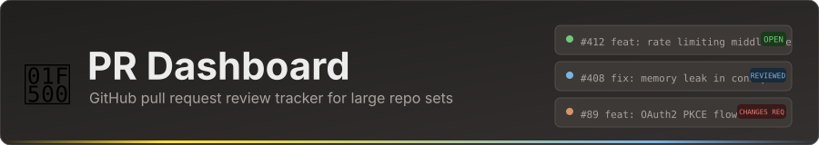
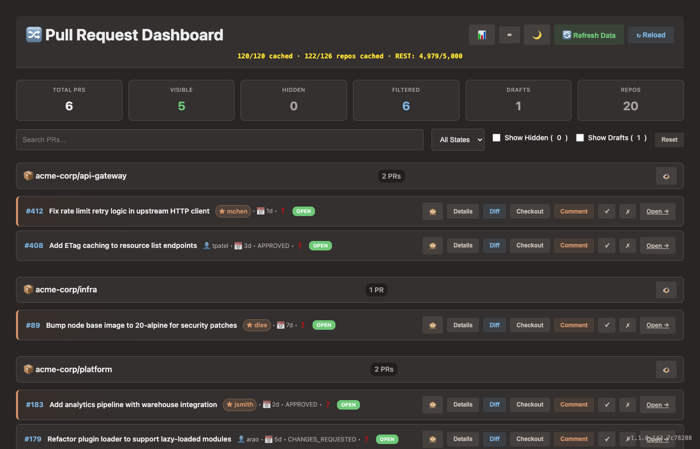
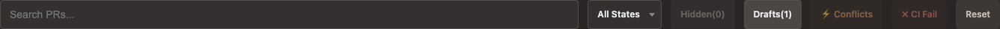
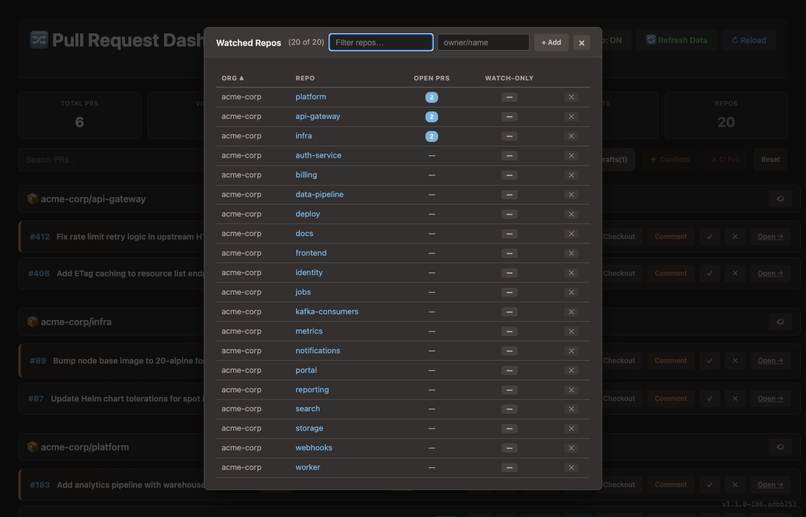
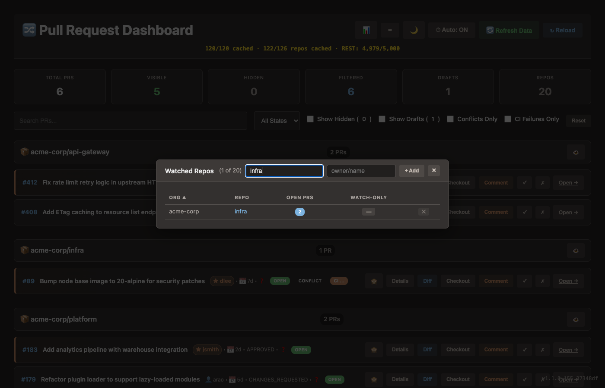
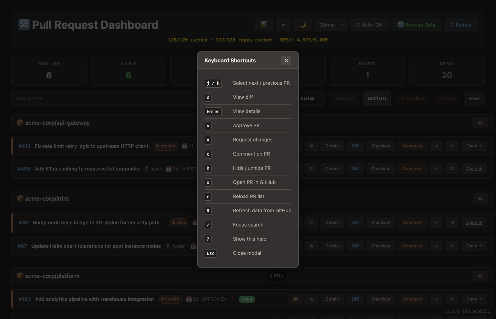

<p align="center">
  
</p>

A containerized pull request dashboard that queries GitHub via GraphQL (PR list and review status) and git smart-HTTP (diffs) to provide a consolidated view of all monitored PRs with review tracking, metrics, and management features.

## Screenshots

### Main dashboard



PRs grouped by repository, with review status badges, metadata, and action buttons on each card.

---

### Stats bar


Real-time counts across Total, Visible, Hidden, Filtered, Drafts, and Repos. The **Repos** tile is clickable.

---

### Filter bar



Keyword search, state filter, Show Hidden / Show Drafts toggles, and a Reset button. All preferences persist across page loads.

---

### Watched repos modal



Sortable table of all watched repos with open PR counts and watch-only status. Click any column header to sort.

- **Add repo** -- type `owner/name` in the input at the top-right and press Enter or click **+ Add**. Writes directly to `~/.config/ghreport/config.yaml`; takes effect on the next refresh.
- **Remove repo** -- click the **✕** button on any row to unsubscribe.
- **Watch-only toggle** -- click the Watch-only cell on any row to set or clear watch-only without needing an open PR from that repo.



Type in the filter box to narrow by org or repo name. Count updates to show matched / total.

---

### Keyboard shortcuts



Press `?` or click the `⌨` button in the header to open the reference modal.

---

## Features

### Core

- **Consolidated PR view** -- all open PRs across monitored repos, grouped by repository with sticky headers
- **Review status tracking** -- Approved / Changes Requested / Commented badges per PR
- **Hide/unhide PRs** -- reduce clutter without losing context; persisted in localStorage; **Unhide All** button in the filter bar clears all hidden PRs at once
- **Watch-only repos** -- mark repos as view-only to suppress review actions; toggle per-repo from the watched repos modal
- **Repo management** -- add or remove watched repos directly from the UI without editing config files
- **Team member highlighting** -- PRs authored by members of a configured GitHub team get an amber left border and a star-prefixed author badge in both the card list and diff modal header; team roster is fetched from GitHub and cached for 60 minutes
- **Search & filter** -- by keyword, PR state (Open/Closed/Merged), hidden status, draft status, merge conflicts, or CI failures
- **CI/CD status indicators** -- per-PR badges for CI FAIL / CI ... / CI ✓ derived from GitHub check-runs; "CI Failures Only" filter to isolate broken PRs
- **Merge conflict detection** -- CONFLICT badge on PRs with `mergeable_state: dirty`; "Conflicts Only" filter; state refreshed on every review status poll
- **PR template preview** -- when opening a comment or review modal, the repo's PR template (`.github/PULL_REQUEST_TEMPLATE.md` or equivalent) is fetched and shown as a collapsible reference; cached for 1 hour per repo
- **Statistics bar** -- real-time counts for Total, Visible, Hidden, Filtered, Drafts, and Repos (clickable)

### Review workflow

- Approve, request changes, or comment directly from the dashboard
- Integrated comment modal (no browser prompts)
- Review buttons in the diff view modal
- PR list refreshes to reflect your new review status after submission

### PR operations

- View PR details and metadata
- View diffs with syntax highlighting (unified and split modes, preference saved)
- Copy PR URL to clipboard (⧉ button on each card)
- Checkout PR branches locally
- Open any PR in GitHub

### Data refresh

- **Refresh Data** -- queries all monitored repositories via batched GraphQL (50 repos/query); typically ~7s for 100+ repos; streams real per-repo progress via SSE
- **Auto-refresh** -- silently runs a full refresh on a configurable interval (30/60/90/120 min, default 30) while the tab is open; select the interval from the dropdown left of the toggle; manual refresh resets the countdown; perf bar shows `auto: Xm ago` after the first auto-refresh fires; toggle with the `⏱ Auto: ON/OFF` button in the header (state and interval persist in localStorage)
- **Reload** -- returns the cached PR list instantly (in-memory cache, 30-minute TTL matching the auto-refresh interval) without hitting GitHub
- **Resilient caching** -- on 403/429/5xx responses, the server serves the last known PR list from its ETag cache rather than returning empty results; protects against GitHub IP outages and secondary rate limits
- **Performance bar** -- displayed below the header after every load or refresh; click it to open a field-by-field explanation modal

#### Performance bar fields

```
refresh: 15.4s · GH: 11.3s · avg: 4.3s · 0/135 cached · 122/126 repos cached · REST: 4,979/5,000
```

| Field | What it measures |
|---|---|
| `refresh: Xs` | Wall-clock time for the complete Refresh Data cycle — from button click to dashboard update |
| `GH: Xs` | Time spent fetching review statuses from GitHub GraphQL for PRs not in the local review cache. Only shown when at least one PR was a cache miss. |
| `avg: Xs` | Rolling average of the last 10 GH review fetch durations |
| `N/M cached` | Review status cache: N PRs had a valid cached status (no GitHub call); M is total PRs. 304 Not Modified responses keep the cached value at zero quota cost. |
| `N/M repos cached` | PR list ETag cache: N repos returned 304 Not Modified (unchanged since last refresh, zero quota cost); M is total watched repos |
| `REST: N/5,000` | GitHub REST API rate limit remaining in the current hourly window. The `/rate_limit` endpoint and ETag 304 responses are exempt and do not count against this total. |
| `auto: Xm ago` | Time since the last automatic background refresh. Only shown after the first auto-refresh fires (every 30 minutes while the tab is open). |

### Metrics page (`/metrics`)

A separate analytics view covering:

- **Review coverage** -- open PRs reviewed vs. pending, as a stacked percentage bar
- **Your review activity** -- donut chart of opened / closed / approved this cycle
- **PR age distribution** -- bar chart bucketed by age
- **Open PRs by repo** -- stacked bars showing reviewed vs. pending per repository
- **Review response time** -- histogram and table of time from PR open to your first review (last 45 days)
- **Author breakdown** -- open PRs by author with reviewed/pending split
- **GitHub API rate limits** -- REST consumption bar vs. the 5,000-request hourly window; PR list ETag cache bar showing 304 (free) vs. 200 (quota) split per refresh, with reset time and % repos skipped

### UI/UX

- Dark/light mode with saved preference
- Compact single-line PR cards for maximum density
- Toast notifications for actions
- Keyboard shortcuts for full mouse-free operation
- Filter preferences (search, state, show-hidden, show-drafts, conflicts-only, CI-failures-only) persist across page loads

## Keyboard Shortcuts

Press `?` or click the `⌨` button in the header to open the in-app shortcuts reference.

| Key | Action |
|-----|--------|
| `j` / `k` | Select next / previous PR |
| `d` | View diff |
| `Enter` | View details |
| `a` | Approve PR |
| `x` | Request changes |
| `c` | Comment on PR |
| `h` | Hide / unhide PR |
| `o` | Open PR in GitHub |
| `r` | Reload PR list |
| `R` | Refresh data from GitHub |
| `/` | Focus search box |
| `?` | Show keyboard shortcuts |
| `Esc` | Close modal |

Action keys (`a`, `x`, `c`) are silently blocked for watch-only repos.

## Prerequisites

- **Podman Desktop** or **Docker**
- **GitHub CLI** (`gh`) installed and authenticated on the host (used for review/comment/diff/checkout operations)
- A GitHub personal access token with `repo` scope

## Setup

### 1. Create environment file

```bash
echo "GH_TOKEN=$(gh auth token)" > .env
```

### 2. Configure watched repos

The dashboard reads `~/.config/ghreport/config.yaml` for the `subscribedRepos` list. The config directory is mounted read-write so the UI can add and remove repos without restarting the container:

```yaml
volumes:
  - ~/.config/ghreport:/root/.config/ghreport:rw
```

The relevant section of the config file:

```yaml
subscribedRepos:
  - org/repo1
  - org/repo2
  - org/repo3
```

Repos can also be managed directly from the dashboard: click the **Repos** stat tile to open the watched repos modal, then use the **+ Add** input or the **✕** remove buttons. Changes write back to `config.yaml` immediately.

You can also pass the list directly via `.env` (takes effect if config.yaml has no `subscribedRepos` section):

```bash
echo 'subscribedRepos=org/repo1 org/repo2 org/repo3' >> .env
```

### 3. Build and start

```bash
make up      # dev mode (live reload)
make build   # production build
```

Or directly:

```bash
podman compose up -d --build
```

### 4. Open the dashboard

[http://localhost:3000](http://localhost:3000)

Metrics: [http://localhost:3000/metrics](http://localhost:3000/metrics)

## Makefile targets

```
make list      # show all targets
make up        # start in dev mode
make down      # stop container
make restart   # restart running container
make logs      # tail container logs
make shell     # exec into container
make build     # full rebuild (production)
make clean     # remove container and image
```

## Configuration

### Environment variables

| Variable | Required | Default | Description |
|----------|----------|---------|-------------|
| `GH_TOKEN` | Yes | -- | GitHub personal access token (`repo` scope) |
| `subscribedRepos` | No | from config.yaml | Space-separated list of `org/repo` to monitor |
| `GHREPORT_CONFIG` | No | `~/.config/ghreport/config.yaml` | Path to the config file inside the container |
| `GHREPORT_OUTPUT` | No | -- | If set, writes a ghreport-format text file after each refresh (for external tooling) |
| `NODE_ENV` | No | `production` | Node environment |
| `PORT` | No | `3000` | Server port |

### Volume mounts (docker-compose.yml)

```yaml
volumes:
  - ~/.config/gh:/root/.config/gh:ro              # gh CLI auth (for review/diff/checkout)
  - ~/.config/ghreport:/root/.config/ghreport:rw  # repo list config (rw so UI can add/remove repos)
  - ~/ghreport-output:/data                       # optional: output file directory
  - ~/.gitconfig:/root/.gitconfig:ro              # git config for checkout
```

### Browser storage (localStorage)

| Key | Description |
|-----|-------------|
| `theme` | `dark` or `light` |
| `hiddenPRs` | Object keyed by `"owner/repo#number"` |
| `watchOnlyRepos` | Object keyed by `"owner/repo"` |
| `autoRefreshEnabled` | `"true"` or `"false"` (default true) |
| `autoRefreshIntervalMin` | `30`, `60`, `90`, or `120` (default 30) |
| `diffView` | `unified` or `split` |
| `filterSearch` | Last search term |
| `filterState` | Last state filter value |
| `filterShowHidden` | Last show-hidden checkbox state |
| `filterShowDrafts` | Last show-drafts checkbox state (default: off) |
| `filterConflicts` | Last "Conflicts Only" filter state |
| `filterCiFail` | Last "CI Failures Only" filter state |

## Architecture

### Stack

- **Base image**: `node:18-alpine`
- **Additional tools**: `github-cli`, `git`
- **Backend**: Node.js 18 + Express 4.18
- **Frontend**: Vanilla JavaScript, no build step
- **Port**: 3000

### How data flows

**Refresh Data (SSE stream)**

```
browser SSE connect → /api/refresh-ghreport-stream
  → read subscribedRepos from config.yaml (or env)
  → fetchAllOpenPRsFromGitHub: batched GraphQL (50 repos/query, ~3 queries for 127 repos)
      each query: { repository { pullRequests(states: OPEN, first: 100) { ... } } }
  → store results in prListCache (in-memory + /data/pr-list-cache.json, 30-min TTL)
  → report real per-repo progress events back to browser (~7s for 126 repos)
```

**Page load / Reload**

```
browser GET /api/prs
  → if prListCache is fresh: return cached PR list instantly
  → else: fetchAllOpenPRsFromGitHub directly, populate cache
  → fetch review status for cache-miss PRs via batched GraphQL (50 PRs/query, max 20/call)
      cache hits skip network round-trip entirely
  → return PRs + review statuses + perf metadata (timing, cache ratio, rate limits)
```

**Diff** uses git smart-HTTP rather than the REST API. Git smart-HTTP is git's native wire protocol tunneled over HTTPS — it talks to `github.com/{owner}/{repo}.git` (the git server), not `api.github.com` (the REST API). These are separate GitHub services with independent rate limits; a REST API ban does not affect git protocol traffic. The server fetches `refs/pull/N/merge` with `--depth=2 --filter=blob:none` (only the merge commit and changed blobs), diffs `FETCH_HEAD~1..FETCH_HEAD`, and caches the resulting bare repo under `/data/diff-cache/` so repeat views are incremental. Falls back to a head+base merge-base diff for conflicting PRs where no merge ref exists.

**Review operations** (approve / request-changes / comment / checkout) use `gh` CLI subprocesses.

### Caching layers

| Layer | TTL | Purpose |
|-------|-----|---------|
| `prListCache` | 30 min | In-memory + `/data/pr-list-cache.json`; survives restarts; TTL matches auto-refresh interval |
| `reviewCache` | 30 min | Per-PR review status; persisted to `/data/review-cache.json`; invalidated immediately on your own review actions |
| `diff-cache` | persistent | Per-repo bare git repos under `/data/diff-cache/`; repeat diff views are incremental fetches |
| `_cachedUser` | 10 min (success) / 35 min (failure) | Authenticated GitHub username; longer failure TTL outlasts the 30-min auto-refresh |
| REST circuit breaker | until `x-ratelimit-reset` + 5 min | Persisted to `/data/gh-backoff.json`; survives restarts; blocks REST calls until GitHub's rate limit window clears |

### API endpoints

| Method | Path | Description |
|--------|------|-------------|
| GET | `/api/prs` | All PRs with review status and perf metadata |
| GET | `/api/user` | Current authenticated GitHub user |
| GET | `/api/team-members` | Members of the configured GitHub team (60-min cache) |
| GET | `/api/pr-template/:owner/:repo` | PR template content for a repo (1-hour cache; returns `null` if none) |
| GET | `/api/repos` | Subscribed repo list |
| POST | `/api/repos` | Add a repo (`{ repo: "owner/name" }`) to config.yaml |
| DELETE | `/api/repos/:owner/:name` | Remove a repo from config.yaml |
| GET | `/api/rate-limit` | Current GitHub API rate limit status (GraphQL + REST) |
| GET | `/api/pr/:owner/:repo/:number` | PR details |
| GET | `/api/pr/:owner/:repo/:number/diff` | PR diff |
| POST | `/api/pr/:owner/:repo/:number/checkout` | Checkout branch locally |
| POST | `/api/pr/:owner/:repo/:number/comment` | Add comment |
| POST | `/api/pr/:owner/:repo/:number/review` | Submit review (approve / request-changes / comment) |
| GET | `/api/refresh-ghreport-stream` | Fetch all open PRs via GraphQL with SSE progress |
| GET | `/api/health` | Health check |
| GET | `/metrics` | Metrics page |

### File structure

```
pr-dashboard/
├── docs/
│   └── screenshots/        # README screenshots
├── public/
│   ├── index.html          # Main dashboard HTML
│   ├── app.js              # Frontend logic
│   ├── metrics.html        # Metrics page (self-contained)
│   └── style.css           # Theming and layout
├── server.js               # Express backend
├── docker-compose.yml      # Container orchestration
├── docker-compose.override.yml  # Dev overrides (live reload)
├── Dockerfile              # Container build
├── Makefile                # Build targets
├── package.json            # Node.js dependencies
└── .env.example            # Environment template
```

## Development

### Updating README screenshots

With the dev server running (`make up` or `node server.js`), regenerate all screenshots in one command:

```bash
node scripts/screenshot.js
```

This uses headless Chromium via puppeteer to capture the main dashboard, stats bar, filter bar, keyboard shortcuts modal, repos modal, and repos modal with search active -- then writes them directly to `docs/screenshots/`. Commit the resulting PNGs.

### Container dev mode

`make up` uses `docker-compose.override.yml` to mount `public/` and `server.js` as live volumes. Source changes are reflected immediately via `node --watch` without rebuilding the image.

### Local (without container)

```bash
npm install
export GH_TOKEN=$(gh auth token)
node server.js
```

The repo list will be read from `~/.config/ghreport/config.yaml` if it exists, or from the `subscribedRepos` env var.

## Troubleshooting

**PRs not loading**
- Check container logs: `podman logs pr-dashboard`
- Confirm `GH_TOKEN` is set and has `repo` scope
- Verify the config file is mounted and contains repos under `subscribedRepos`
- Click **Refresh Data** to trigger a fresh GraphQL fetch

**Review status not showing**
- Open browser console (F12) and look for: `Current authenticated user: yourusername`
- 404/403 errors for private or deleted repos are silently ignored

**Missing repos in the dashboard**
- Click the **Repos** stat tile to open the watched repos modal; use **+ Add** to subscribe without editing files
- Ensure `~/.config/ghreport/config.yaml` is mounted and contains the repo under `subscribedRepos`
- Config changes via the UI take effect on the next refresh — no restart needed

**Container won't start**
- `podman ps -a` and `podman logs pr-dashboard --tail 50`
- `make clean && make build` to rebuild from scratch

## License

MIT
